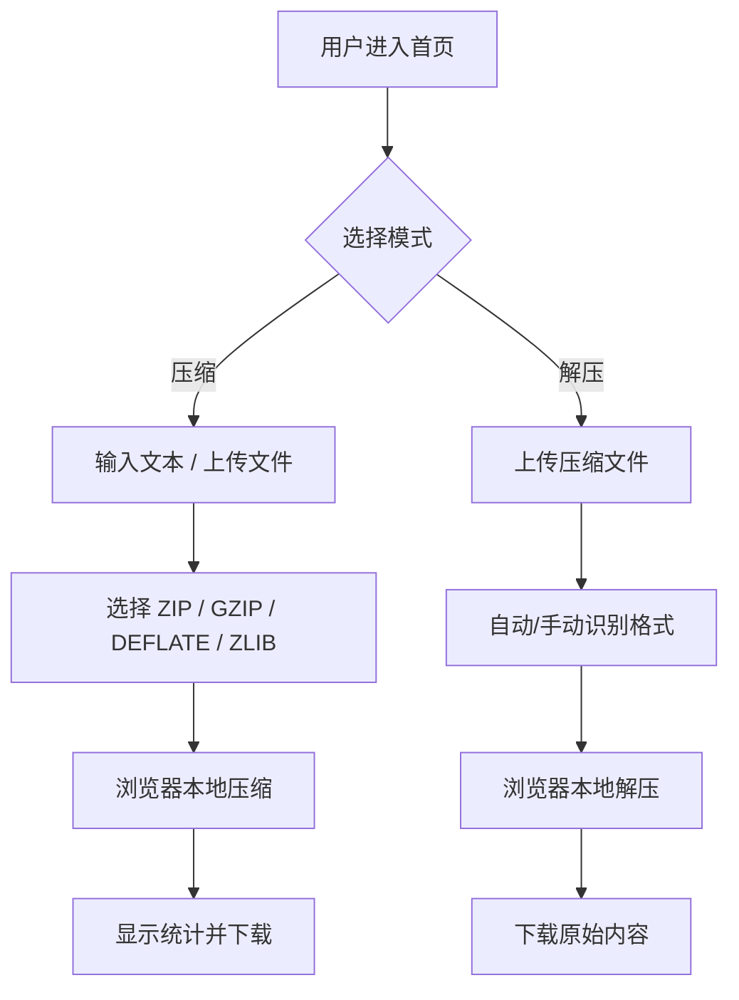

# 快速压缩网站 PRD

## 1. 产品概述
一个纯前端、无需后端的在线压缩/解压工具。用户可以粘贴文本或上传文件，选择压缩格式后立即得到压缩包；也支持上传已压缩文件进行解压。所有计算在浏览器本地完成，保护数据隐私。

## 2. 核心功能

### 2.1 用户角色
| 角色 | 使用方式 | 核心权限 |
|------|----------|----------|
| 普通用户 | 无需注册 | 使用全部压缩/解压功能 |

### 2.2 功能模块
1. **压缩面板**：输入文本或上传文件，选择格式，一键压缩并下载
2. **解压面板**：上传压缩文件，自动识别格式，解压并下载原始内容
3. **统计信息**：显示原始大小、压缩后大小、压缩率

### 2.3 页面详情
| 页面 | 模块 | 功能描述 |
|------|------|----------|
| 首页 | 压缩面板 | 文本输入框、文件拖拽上传区、格式选择（ZIP/GZIP/DEFLATE/ZLIB）、压缩按钮、下载结果 |
| 首页 | 解压面板 | 文件上传区、格式选择/自动识别、解压按钮、下载解压结果 |
| 首页 | 统计区 | 实时显示原始大小、压缩后大小、压缩率 |

## 3. 核心流程

用户进入首页后，在顶部选择「压缩」或「解压」标签。

**压缩流程**：
1. 用户输入文本或拖拽上传文件
2. 选择目标压缩格式（默认 ZIP）
3. 点击「压缩」按钮
4. 浏览器本地执行压缩算法
5. 展示压缩统计
6. 用户下载输出文件（ZIP/GZIP/DEFLATE/ZLIB 对应扩展名）

**解压流程**：
1. 用户上传压缩文件
2. 系统根据扩展名自动推断格式，也可手动选择
3. 点击「解压」按钮
4. 浏览器本地执行解压算法
5. 用户下载解压后的文件或文本

## 4. 用户界面设计

### 4.1 设计风格
- **主题**：工业机能风（Industrial / Utilitarian）+ 终端感
- **主色**：深灰 `#0d0d0d` 背景，亮黄 `#f2c94c` 作为强调色，米白 `#f4f4f0` 作为文字色；整体配色避免使用任何绿色
- **按钮**：粗边框、锐利直角、hover 时反色填充，传递工具的可靠感
- **字体**：标题使用粗壮的英文展示字体 `Syne` + 系统中文字体；正文使用等宽字体 `JetBrains Mono`，强化数据与代码感
- **布局**：居中卡片式布局，信息层级分明，操作区分割清晰
- **图标**：简洁线性图标，配合高对比色块

### 4.2 页面设计概览
| 页面 | 模块 | UI 元素 |
|------|------|---------|
| 首页 | 顶部标题 | 大号 Syne 字体 LOGO + 简短 slogan |
| 首页 | 模式切换 | 胶囊/直角标签按钮（压缩 / 解压） |
| 首页 | 输入区 | 文本域、拖拽上传区、已上传文件列表 |
| 首页 | 操作区 | 格式下拉框、压缩/解压按钮、下载按钮 |
| 首页 | 统计区 | 三列数据卡片：原始大小 / 压缩后大小 / 压缩率 |

### 4.3 响应式设计
- 桌面优先，最大宽度 960px 居中
- 平板/手机下输入区与统计区自动堆叠为单列
- 拖拽上传区在触控设备上加大点击区域

### 4.4 动画与微交互
- 页面加载时标题与卡片依次淡入（stagger 200ms）
- 拖拽文件进入上传区时边框高亮并轻微放大
- 压缩过程中按钮显示加载动画
- 统计数字变化时使用平滑过渡
