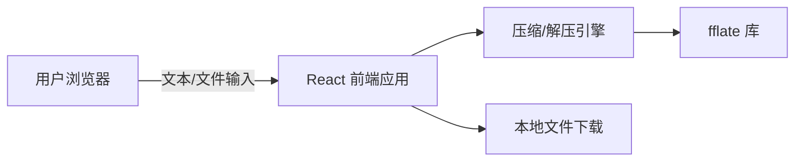

# 快速压缩网站 技术架构

## 1. 架构设计



纯前端架构，无后端服务。所有压缩与解压计算在浏览器 Web Worker 或主线程中完成，文件通过 `URL.createObjectURL` 提供下载。

## 2. 技术选型

- **前端框架**：React 18 + TypeScript
- **构建工具**：Vite 5
- **样式方案**：Tailwind CSS 3
- **UI 组件**：自定义组件（无需完整组件库，保持轻量）
- **压缩库**：
  - `fflate`：提供 ZIP、GZIP、DEFLATE、ZLIB 的压缩与解压
- **图标**：内联 SVG

## 3. 路由定义

| 路由 | 用途 |
|------|------|
| `/` | 首页，包含压缩与解压两个标签页 |

单页应用，无额外路由。

## 4. 核心模块说明

### 4.1 压缩引擎（compression.ts）

对外暴露统一接口：

```typescript
export interface CompressOptions {
  format: 'zip' | 'gzip' | 'deflate' | 'zlib';
  level?: number;
}

async function compress(
  inputs: { name: string; data: Uint8Array }[],
  options: CompressOptions
): Promise<{ data: Uint8Array; filename: string; ext: string }>;
```

- **ZIP**：使用 `fflate.zip` 将多个文件打包为 .zip
- **GZIP**：使用 `fflate.gzip` 对单个文件/文本进行压缩，输出 .gz
- **DEFLATE**：使用 `fflate.deflate` 对单个文件/文本进行压缩，输出 .deflate
- **ZLIB**：使用 `fflate.zlib` 对单个文件/文本进行压缩，输出 .zlib

### 4.2 解压引擎（decompression.ts）

```typescript
interface DecompressResult {
  files: { name: string; data: Uint8Array }[];
}

async function decompress(
  file: File,
  format?: 'zip' | 'gzip' | 'deflate' | 'zlib'
): Promise<DecompressResult>;
```

- **ZIP**：使用 `fflate.unzip` 解析 .zip
- **GZIP**：使用 `fflate.gunzip` 解压 .gz
- **DEFLATE**：使用 `fflate.inflate` 解压 .deflate
- **ZLIB**：使用 `fflate.unzlib` 解压 .zlib

## 5. 数据模型

无需持久化数据库。运行时数据结构：

```typescript
interface InputFile {
  id: string;
  name: string;
  size: number;
  data: Uint8Array;
}

interface CompressionJob {
  inputs: InputFile[];
  format: CompressionFormat;
  result?: Uint8Array;
  ratio?: number;
}
```

## 6. 性能与安全

- 文件处理使用 `Uint8Array`，避免大字符串操作
- 单文件上限 100MB（浏览器内存限制），超出时给出提示
- 所有计算在本地完成，不上传服务器
- 输出文件通过 Blob 和临时 URL 下载
